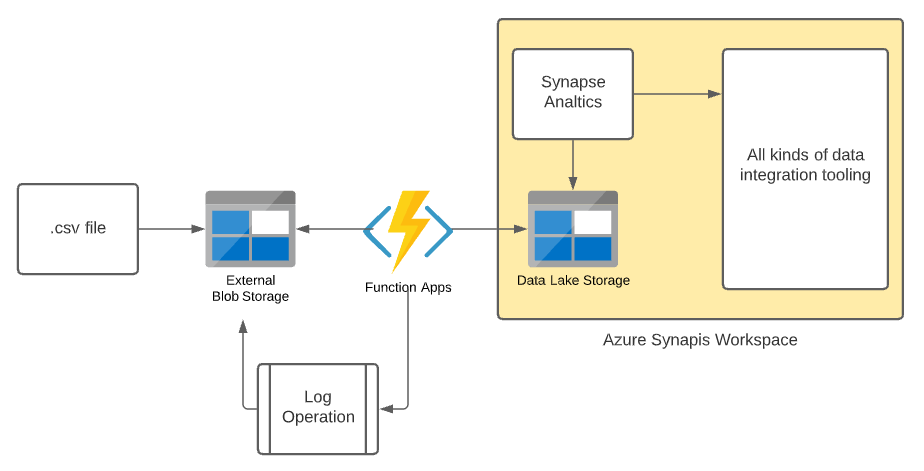

This sample provides a simple example for pushing blob messages from an Azure storage account container to an Azure Data Lake which is the default storage container for an Azure Synapse workspace.

The example provides a reference for a function exposing a Blob Trigger and Input and a Blob output. Added preview feature that attributes [retry resiliency](https://docs.microsoft.com/azure/azure-functions/functions-bindings-error-pages?tabs=csharp), but the functionality threw an exception in the GCC. 

